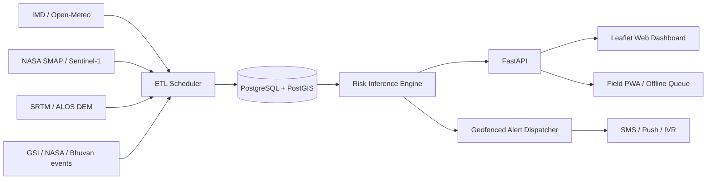

# Architecture diagram

```mermaid
flowchart LR
  A[IMD / Open-Meteo] --> E[ETL Scheduler]
  B[NASA SMAP / Sentinel-1] --> E
  C[SRTM / ALOS DEM] --> E
  D[GSI / NASA / Bhuvan events] --> E
  E --> F[(PostgreSQL + PostGIS)]
  F --> G[Risk Inference Engine]
  G --> H[FastAPI]
  H --> I[Leaflet Web Dashboard]
  H --> J[Field PWA / Offline Queue]
  G --> K[Geofenced Alert Dispatcher]
  K --> L[SMS / Push / IVR]
```
